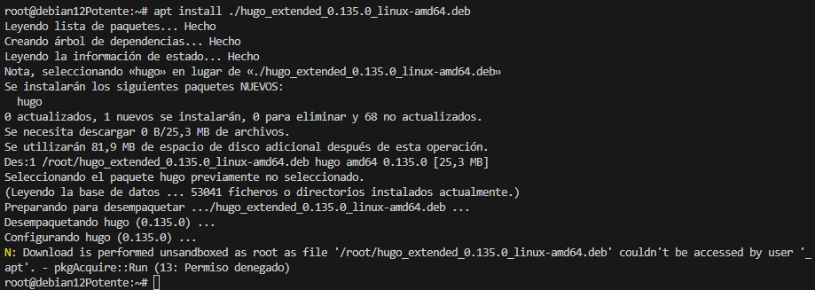

# Crear un Sitio Web con el Tema Libre Usando SSG Hugo y Desplegarlo en GitHub Pages y Cloudflare

## Introducción

Crear un sitio web estático con Hugo es una excelente manera de desarrollar un blog o un sitio personal, aprovechando su velocidad y facilidad de uso. En este tutorial, he cubierto los pasos necesarios para crear un sitio utilizando Hugo, instalar y configurar el tema Walden, y luego desplegarlo en GitHub Pages para su publicación en línea. He detallado desde la instalación de Hugo y su configuración inicial hasta la integración de un flujo de trabajo de GitHub Actions para automatizar el proceso de despliegue.

### **Paso 1: Instalamos Hugo**

Para poder crear sitios con Hugo, primero instalamos la herramienta. Fuimos a la página de [releases de Hugo](https://github.com/gohugoio/hugo/releases) para descargar la versión adecuada. Elegimos un paquete `.deb` compatible con nuestro sistema operativo. Esto asegura una instalación específica para nuestra plataforma.

Después, utilizamos `wget` para descargar el archivo y `apt` para instalarlo. Finalmente, verificamos que Hugo estuviera instalado correctamente.

```bash
sudo apt update -y
wget https://github.com/gohugoio/hugo/releases/download/v0.135.0/hugo_extended_0.135.0_linux-amd64.deb

```


```
sudo apt install ./hugo_extended_0.135.0_linux-amd64.deb
hugo version
```



---

### **Paso 2: Creamos un repositorio vacío en GitHub**

Para comenzar, configuramos un lugar donde guardar nuestro proyecto en línea. Abrimos nuestra cuenta en GitHub, hicimos clic en **New**, y creamos un repositorio vacío llamado `actividad22_2_RRH`. Dejamos el repositorio sin archivos adicionales como `README.md` o `.gitignore`.


---

### **Paso 3: Clonamos el repositorio vacío**

En nuestra máquina local, fuimos al directorio donde queríamos trabajar. Descargamos el repositorio vacío de GitHub utilizando `git clone`. Después de clonar, entramos en el directorio para empezar a trabajar.


Y luego combromos si el repositorio en local esta conectado con el que está en github : con ``` git remote -v ```


---

### **Paso 4: Inicializamos un proyecto Hugo en el repositorio**

En el directorio del repositorio clonado, creamos la estructura básica de Hugo directamente. Esto incluyó carpetas como `content`, `layouts`, y el archivo de configuración `config.toml`.

```bash
hugo new site .
```

---

### **Paso 5: Configuramos el tema Walden**

1. **Añadimos el tema como submódulo**  
   Decidimos usar el tema **Walden**. Lo descargamos como submódulo para facilitar futuras actualizaciones. Esto lo colocó en la carpeta `themes`.

   ```bash
    git submodule add https://github.com/Homecat805/hugo-theme-walden.git themes/hugo-theme-walden
  
   ```
   

2. **Iniciamos y actualizamos los submódulos**  
   Hugo requiere que los submódulos estén inicializados y actualizados para que funcionen correctamente.

   ```bash
   git submodule init
   git submodule update
   ```
   

3. **Copiamos los archivos de ejemplo**  
   Para comenzar rápidamente, copiamos los archivos de ejemplo del tema al directorio raíz.

   ```bash
   cp -rf themes/hugo-theme-walden/exampleSite/* ./
   ```
    


4. **Configuramos el tema en el archivo `hugo.toml`**  
   Agregamos el tema **Walden** a la configuración del sitio para que Hugo lo utilice.

   ```bash
   echo "theme = 'hugo-theme-walden'" >> hugo.toml
   ```

    
---

### **Paso 6: Creamos posts y añadimos imágenes**


1. **Creamos publicaciones**  
   Las publicaciones se guardan en la carpeta `content/en/blog/carpeta del post /index.md`. Segun el tema walden las carpetas de los posts tienen que tener los nombres :  sample1,sample2,3...  
   Por ejemplo, creamos un nuevo post así: 

    

    Para que otras personas puedan hacer cambios en este repositorio en local y añadir posts hacemos un pull request :
  Ejemplo Desde Rimsha :
  
  Ejemplo Desde Rodrigo :
  

2. **Almacenamos imágenes**  
   Las imágenes del sitio se colocaron en el directorio `content/en/blog/nombre de la carpeta del post/imagen`. Esto asegura una estructura organizada. Segun el tema walden las imagenes tienen que ser 2 de los nombres siguentes : headline.jpg , y thumbnail.jpg
   ejemplo :

   


3. **Ejemplo de la structura**

    

---

### **Paso 7: Probamos el sitio localmente**

Levantamos el servidor de desarrollo para revisar el sitio localmente. Usamos la opción `--bind` para asegurarnos de que fuera accesible desde otras direcciones IP en la misma red.

```bash
hugo server --bind 10.0.22.201
```


  Visitamos el sitio en `http://10.0.22.201:1313` para verificar su apariencia.

  

---

### **Paso 8: Construimos el sitio**

Generamos los archivos estáticos del sitio. Estos se guardaron en el directorio `public`. Esto es necesario para subir el sitio a cualquier plataforma de hosting.

```bash
hugo
```
Que tambien el commando :**hugo server --bind 10.0.22.201** lo hace :
Ejemplo :


---

### **Paso 9: Configuramos el despliegue en GitHub Pages**

Creamos un archivo `.github/workflows/hugo.yml` para automatizar el despliegue en GitHub Pages. Este archivo contiene instrucciones para compilar el sitio con Hugo y desplegarlo.


Contenido de `hugo.yml`:

```yaml
# Sample workflow for building and deploying a Hugo site to GitHub Pages
name: Deploy Hugo site to Pages

on:
  # Runs on pushes targeting the default branch
  push:
    branches:
      - main

  # Allows you to run this workflow manually from the Actions tab
  workflow_dispatch:

# Sets permissions of the GITHUB_TOKEN to allow deployment to GitHub Pages
permissions:
  contents: read
  pages: write
  id-token: write

# Allow only one concurrent deployment, skipping runs queued between the run in-progress and latest queued.
# However, do NOT cancel in-progress runs as we want to allow these production deployments to complete.
concurrency:
  group: "pages"
  cancel-in-progress: false

# Default to bash
defaults:
  run:
    shell: bash

jobs:
  # Build job
  build:
    runs-on: ubuntu-latest
    env:
      HUGO_VERSION: 0.134.2
    steps:
      - name: Install Hugo CLI
        run: |
          wget -O ${{ runner.temp }}/hugo.deb https://github.com/gohugoio/hugo/releases/download/v${HUGO_VERSION}/hugo_extended_${HUGO_VERSION}_linux-amd64.deb \
          && sudo dpkg -i ${{ runner.temp }}/hugo.deb          
      - name: Install Dart Sass
        run: sudo snap install dart-sass
      - name: Checkout
        uses: actions/checkout@v4
        with:
          submodules: recursive
          fetch-depth: 0
      - name: Setup Pages
        id: pages
        uses: actions/configure-pages@v5
      - name: Install Node.js dependencies
        run: "[[ -f package-lock.json || -f npm-shrinkwrap.json ]] && npm ci || true"
      - name: Build with Hugo
        env:
          HUGO_CACHEDIR: ${{ runner.temp }}/hugo_cache
          HUGO_ENVIRONMENT: production
          TZ: America/Los_Angeles
        run: |
          hugo \
            --gc \
            --minify \
            --baseURL "${{ steps.pages.outputs.base_url }}/"          
      - name: Upload artifact
        uses: actions/upload-pages-artifact@v3
        with:
          path: ./public

  # Deployment job
  deploy:
    environment:
      name: github-pages
      url: ${{ steps.deployment.outputs.page_url }}
    runs-on: ubuntu-latest
    needs: build
    steps:
      - name: Deploy to GitHub Pages
        id: deployment
        uses: actions/deploy-pages@v4
```

---

### **Paso 10: Subimos los cambios a GitHub**

Finalmente, añadimos los archivos al control de versiones, hicimos un commit, y empujamos los cambios al repositorio remoto.

```bash
git add .
git commit -m "Sitio Hugo con tema Walden"
git push origin main
```

## Desplegar el Sitio en GitHub Pages Usando GitHub Actions :

Para completar el despliegue de nuestro sitio en GitHub Pages utilizando **GitHub Actions**, sigamos estos pasos:

1. **Preparar los archivos necesarios**  
   -> Nos aseguramos de haber creado la carpeta `.github` y dentro de ella el archivo `hugo.yml`. Este archivo contiene la configuración que necesitamos para automatizar el despliegue con **Hugo**.

2. **Acceder a la configuración del repositorio**  
   -> Entramos en nuestro repositorio en GitHub y hacemos clic en la pestaña **Settings** (Configuración) que aparece en la barra superior.

3. **Configurar GitHub Pages**  
   -> Buscamos la sección **Pages** dentro de la configuración. Seleccionamos la opción **GitHub Actions** en lugar de "Deploy from a branch" (Desplegar desde una rama). Esto nos permitirá usar el flujo configurado en `hugo.yml` para manejar el despliegue.

   

4. **Comprobar el despliegue en el navegador**  
   -> Una vez configurado todo, abrimos un navegador web e ingresamos la URL del sitio publicada por GitHub Pages para verificar que esté funcionando correctamente.

    

## Desplegar el Sitio en Cloudfare :

1. **Acceder a nuestra cuenta de Cloudflare**  
   -> Ingresamos a nuestra cuenta de Cloudflare y accedemos al panel de control.

2. **Configurar el despliegue**  
   -> No necesitamos incluir el comando de construcción del sitio, ya que el sitio ya está creado de forma local. Solo necesitamos configurarlo para que utilice la carpeta **public** generada en el proceso de construcción local.

3. **Seleccionar la carpeta public**  
   -> En la configuración de Cloudflare, especificamos la carpeta public que contiene los archivos del sitio que queremos desplegar.

4. **Implementar el sitio**  
   -> Implementamos el sitio .
   
   

5. **Comprobar el despliegue**  
   -> Finalmente, accedemos a la URL del sitio en Cloudflare a través de un navegador para verificar que el sitio esté correctamente desplegado y accesible.
   

   - El enlace del sitio despligado en github pages : https://hafsa-katkout.github.io/actividad22_2_RRH/

   - El enlce del sitio despligado en cloudfare :https://actividad22-2-rrh.pages.dev/


## Conclusión

Siguiendo los pasos proporcionados, logré crear un sitio estático con Hugo, personalizarlo con el tema Walden, y automatizar su publicación en GitHub Pages. Este proceso no solo facilita la creación y personalización de sitios web, sino que también permite un flujo de trabajo eficiente al integrar herramientas como GitHub y GitHub Actions para despliegue continuo. Ahora, con estos conocimientos, puedo seguir creando y personalizando más sitios con Hugo y mantenerlos actualizados de manera sencilla.
