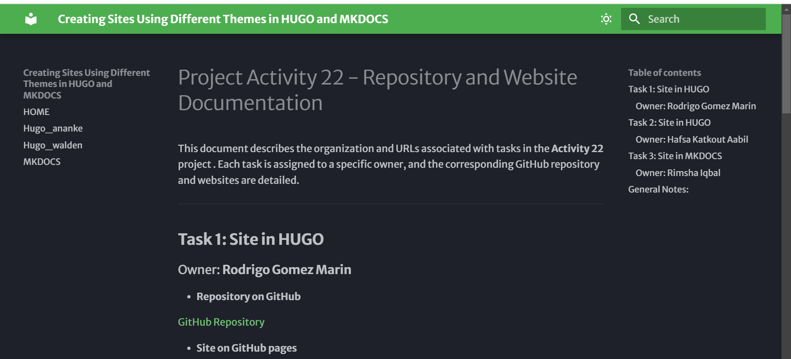

## Índice

- [Introducción a MkDocs](#introducción-a-mkdocs)
- [Requisitos Previos](#requisitos-previos)
  - [Actualización del paquete](#actualización-del-paquete)
  - [Instalación de git](#instalación-de-git)
  - [Instalación de Python Y pip](#instalación-de-python-y-pip)
  - [Instalación módulo gestor de entornos virtuales](#instalación-módulo-gestor-de-entornos-virtuales)
  - [Creación de un nuevo entorno virtual de Python](#creación-de-un-nuevo-entorno-virtual-de-python)
- [Instalación de MkDoc](#instalación-de-mkdoc)
- [Comprobaciones Iniciales](#comprobaciones-iniciales)
- [Creación de Git Hub repository](#creación-de-git-hub-repository)
- [Creación de sitio MKDOCS](#creación-de-sitio-mkdocs)
- [Configuración en "mkdocs.yml"](#configuración-en-mkdocsyml)
- [Servidor local de Desarrollo](#servidor-local-de-desarrollo)
- [Construcción y Publicación](#construcción-y-publicación)
- [Creación de rama gh-pages](#creación-de-rama-gh-pages)
- [Construcción del Sitio](#construcción-del-sitio)
- [Subir tema en el GitHub](#subir-tema-en-el-github)
- [Publicación en GitHub Pages](#publicación-en-github-pages)
- [Publicación en CloudFlare](#publicación-en-cloudflare)
  - [Configurar un Dominio Personalizado](#configurar-un-dominio-personalizado)

## Introducción a MkDocs
[**MkDocs**](https://www.mkdocs.org/) es una herramienta rápida y sencilla para crear documentación estática con Markdown. Es ideal para desarrolladores que deseen documentar sus proyectos.

## Requisitos Previos

### Actualización del paquete  
- Iniciamos sesion como administrador.  
- Antes de instalar algo actualizamos paquetes de Debian 12.   
- Usamos el comando "apt update -y"
- 
###  Instalación de git  

Con el comando "apt install git" Instalamos git en nuestra máquina
de **Debian 12**.

### Instalación de Python Y pip 

Para instalar temas de tercero es necesario que instalamos paquete de Python y pip. 
- Con el comando "apt install python3" Instalamos una versión reciente de python3.  
  

- Con el comando "apt install python3-dev python3-pip" Instalamos **pip** es es gestor de paquetes de Python.
  
### Instalación módulo gestor de entornos virtuales
- Con el comando "apt install python3.11-venv" instalamos el módulo gestor de entornos virtuales.

###  Creación de un nuevo entorno virtual de Python 
Python necesita un directorio específico donde ubicar todos su software y librería (entorno virtual). Para crear y activar este entorno virtual los pasos son:  
- Vamos a nuestro directorio de usuario cond "cd /home/usuario"
- Aquí crearemos un directorio con nuestro entorno de Python.
- Con "python3 -m venv my-env" creamos una carpeta llamada my-env con todos el software y librerías de python.
- Con el comando "source my-env/bin/activate" activamos entorno.
- **Nota:** Para salir del entorno ejecuta: deactivate

## Instalación de MkDoc
- Con el comando "pip3 install mkdocs" instalamos MKDOCS.  
  
## Comprobaciones Iniciales
- Para moestrar la versión de Python 3 que está instalado actualmente en nuestro sistema ejecutamos el comando **"python3 - -version"**.  

    

-  El comando **"pip3 - -version"** uuestra la versión instalada de pip, el gestor de paquetes de Python, y la versión de Python con la que está asociada.

      

-  Con el comando **"pip3 install requests"** Instalamos la biblioteca requests, que es una de las más utilizadas en Python para realizar solicitudes HTTP.
-  El comando **"pip3 list"** ista todos los paquetes de Python instalados en el entorno actual junto con sus versiones.  

-  Con el comando **"pip3 freeze"**  muestramos todos los paquetes de Python instalados en un formato adecuado para un archivo requirements.txt.
-  Con el comando **"mkdocs --version"** muestramos la versión instalada de MkDocs, confirmando que está presente en el entorno.  

## Creación de Git Hub repository

- En la cuenta de GitHub creamos un repositorio llamado **"actividad22_3_RRH"** Sin fichero de fichero de README.

## Creación de sitio MKDOCS

- Con **"mkdocs new actividad22_3_RRH"** Creamos nuestro sitio MKDCOS llamado **"actividad22_3_RRH"**.
- Vamos a este diretorio con **"cd actividad22_3_RRH"**.
- Con el comando "git init" creamos el directorio como repositorio local.
- Luego con **"git remote add origin url-github-repo"** creamos una conexión remota con github repositorio.

## Configuración en "mkdocs.yml"

- En el directorio de **"actividad22_3_RRH"** con el comando **"ls"** listamos todos los el contenido del sitio **actividad22_3_RRHH**.
- Con **nano makdocs.yml** abrimos y fichero mkdocs.yml. Este es el fichero de configuración de sitio mkdocs.
- Dentro de este fichero Ponemos nombre de nuestro sitio **(site_name:)**.
- ponemos url del sitio **(site_url:)**.
- Luego creamos un secsión de nav **(nav:)**.
- En nav ponemos nombres de las paginas y sus ficheros.
- En mi caso you tengo las siguientes paginas:
  - HOME
  - Hugo_anakle (página creado por Rodrigo)
  - Hugo_walden (página creado por Hafsa)
  - MKDOCS (página creado por Rimsha)
- Luego aqui pongo tema de mi sitio **(Theme: material)**.
- También establecemos una esquema de color, logo y copyright.

## Servidor local de Desarrollo

- Iniciamos un servidor local con el comando **"mkdocs serve"**.
- Y visitamos el sitio desde el navegador.

  
## Construcción y Publicación

- El comando **"mkdocs build** Construye el sitio estático (formado por html, css y javascript) y lo almacena en un directorio llamado: **site.**
  
## Creación de rama gh-pages
- Con el comando "mkdocs gh-deploy" creamos una nueva rama llamada gh-pages en el 
repositorio local donde almacena el sitio web y lo despliega en GitHub 
Pages.

## Construcción del Sitio
- En el directorio **"actividad22_3_RRH"** Cambiamos la rama con **"git checkout gh-pages".
- Aquí Creamos los  fichero markdown de nuestro sitio web (HOME, Hugo_anakle, Hugo_walden, MKDOCS).
  
## Subir tema en el GitHub
- Con el commando **"git add ."** subimos los cambios al repositorio local.
- Con **git commit -m "mensjae"** guardamos los cambios en el historial del repositorio local.
- Con **"git push origin gh-pages"** subimos los cambios al repositorio remota en git hub.

## Publicación en GitHub Pages
- Abrimos el rpositorio y vamos a **settings**.
- Luego Vamos a pages.
- Aquí en el Sección de **"Build and Deployment"** seleccionamso "Deploy from branch" y seleccionamos la rama **"gh-pages"** del carpeta **"root"**.
- En **Actions** cuano el proceso de desplegar el sitio es completo puede visitar el sitio.

## Publicación en CloudFlare

- Iniciamos sesión en el cuenta de CloudFlare.
-  Vamos a la sección **Pages** desde el panel de control.
- Hacemos clic en **Create a project**.

### Configurar un Dominio Personalizado
- Aquí en la sección **Pages**, seleccionamos repositorio de **·actividad22_3_RRH"**.
- Luego desplegamos este sitio web utilizando url que ha generado CloudFlare.  

  